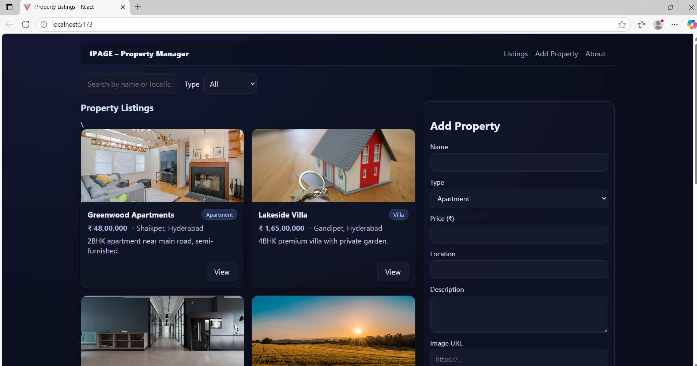

---

# 🏠 Property Listings App

A modern React-based web application for browsing, filtering, and managing property listings. This project demonstrates CRUD functionality using a mock backend with `json-server`, along with a responsive UI built in React.

---

## 📌 Features

* View a list of properties with images, descriptions, and prices.
* Add new property listings via a simple form.
* Filter properties based on criteria (e.g., price, type, location).
* Interactive property details modal.
* Loader and responsive design for a smooth user experience.

---

## 🛠️ Methodology

The project follows a **modular component-based methodology**:

1. **Frontend Framework**

   * Built using **React 18 + Vite** for a fast development environment.
   * Component-based structure ensures scalability and reusability.

2. **Data Layer**

   * Mock data is managed through **db.json** (simulating a backend).
   * `json-server` exposes RESTful API endpoints (`GET`, `POST`).
   * API calls are handled in `src/api.js`.

3. **State Management**

   * React Hooks (`useState`, `useEffect`, `useMemo`) manage application state.
   * Filtering and searching happen on the client side for responsiveness.

4. **UI/UX Design**

   * Dark theme with gradient backgrounds for modern aesthetics.
   * Flexbox & CSS Grid for responsive layouts.
   * Separate stylesheets for modular design (`index.css`, `App.css`).

5. **Testing & Validation**

   * Validations in Add Property Form (required fields, numeric price, optional coordinates).
   * Error handling for failed API calls.

---

## 📊 Sample Data (db.json)


```
{
  "properties": [
    {
      "id": 1,
      "name": "Greenwood Apartments",
      "type": "Apartment",
      "price": 4800000,
      "location": "Shaikpet, Hyderabad",
      "description": "2BHK apartment near main road, semi-furnished.",
      "image": "https://images.unsplash.com/photo-1501183638710-841dd1904471",
      "coordinates": { "lat": 17.402, "lng": 78.403 }
    }
  ]
}

```

---

## 📂 Project Structure

```
property-listings-app/
│── db.json            # Mock API seed data
│── routes.json        # Custom API routes
│── package.json       # Dependencies & scripts
│── vite.config.js     # Vite configuration
│── index.html         # App entry point
│── /src
│   │── App.jsx        # Main App component
│   │── api.js         # API integration
│   │── main.jsx       # React root
│   │── /components    # Reusable components
│   │   │── AddPropertyForm.jsx
│   │   │── Filters.jsx
│   │   │── Header.jsx
│   │   │── Loader.jsx
│   │   │── PropertyCard.jsx
│   │   │── PropertyModal.jsx
│   │   │── Temp.jsx
│   │── /styles        # CSS styling
│   │   │── index.css
│   │   │── App.css
│── /screenshots       # Add screenshots for documentation
```

---

## 🚀 Getting Started

### 1️⃣ Clone the Repository

```bash
git clone https://github.com/smaranng/Property-Listing-React.git
cd property-listings-app
```

### 2️⃣ Install Dependencies

```bash
npm install
```

### 3️⃣ Run Mock API Server

```bash
npm run server
```

### 4️⃣ Run the React App

```bash
npm run dev
```

The app should now be running at **[http://localhost:5173/](http://localhost:5173/)** 🚀

---

## 📸 Screenshots

Screenshots of the app in action:

* **Property Listings**


  

* **Add Property Form**
  

* **Property Modal**
  


---

## 📦 Tech Stack

* **Frontend:** React (Vite), JSX, CSS
* **Backend:** json-server (Mock API)
* **Others:** npm, REST API, GitHub

---

## ✨ Future Enhancements

* User authentication (login/signup).
* Search bar with autocomplete.
* Map integration for property locations.
* Deployment on Vercel/Netlify.

---


